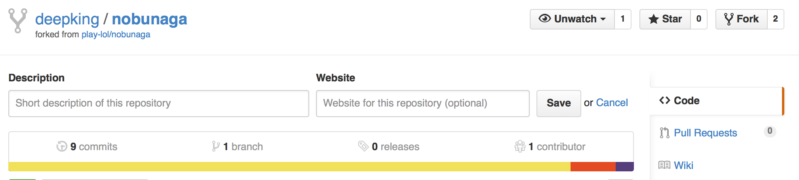
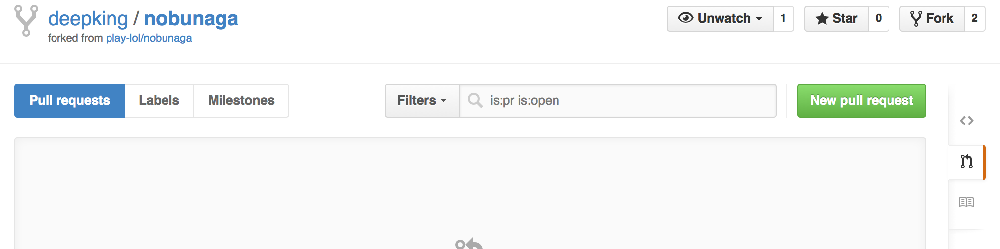
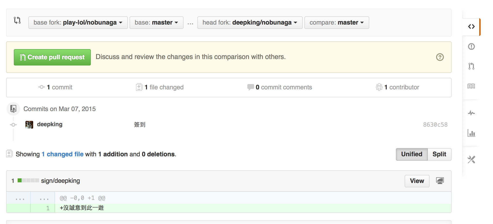
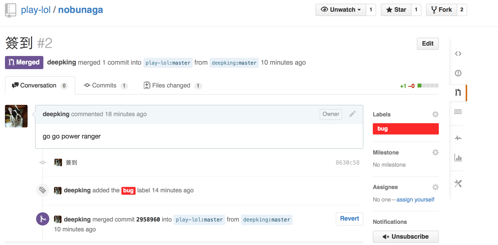

# nobunaga

# 環境設定
安裝以下軟體:

1. [NodeJS](http://nodejs.org/download/)

2. [Git](http://git-scm.com/download/win)

3. [Sublime Text](http://www.sublimetext.com/)

# 執行
使用 Git 附帶的 Cmd 執行以下 Command

1. 下載 source code

    ```
    git clone https://github.com/play-lol/nobunaga.git
    ```

2. 進入資料夾 nobunaga

    ```
    cd nobunaga
    ```

3. 安裝需要的 libraray dependencies, 定義在 package.json

    ```
    npm install
    ```

4. 執行 server

    ```
    DEBUG=nobunaga:* ./bin/www
    ```
    open browser http://localhost:3000

# devdocs
http://devdocs.io/

enable 以下文件，並在右上**Offline**選擇 Install All,方便查詢
- CSS
- DOM
- DOM Events
- Express
- HTML
- JavaScript
- jQuery
- Node.js


# git
只需要基本 clone, add, commit, push, pull, merge 以及處理 conflict
- [練習](https://github.com/deepking/nevernote/blob/master/git.md)
- [連猴子都能懂的入門指南](http://backlogtool.com/git-guide/tw/intro/intro2_4.html)
- [Git Magic](http://www-cs-students.stanford.edu/~blynn/gitmagic/intl/zh_tw/ch02.html)
- [Git CodeSchool](https://try.github.io)

第一次抓 code
```
git clone https://github.com/play-lol/nobunaga.git
```

加入 git stage, 表示加入存檔範圍
```
git add FileName
```

commit 等同於打王前存檔
```
git commit -m "your message"
```

下載 code
```
git pull
```

上傳 code
```
git push origin master
```

# 需要瞭解
優先看 [Javascript](http://www.w3schools.com/js/default.asp), client server 都需要
- [練習](https://github.com/deepking/nevernote/blob/master/js.md)
- [Javascript CodeSchool](http://javascript-roadtrip.codeschool.com)

server side
- [練習](https://github.com/deepking/nevernote/blob/master/node.md)
- [NodeJS](http://nodejs.org/)
- [Express](http://expressjs.com/)

client side
- [jQuery](http://learn.jquery.com/)
  - [jQuery CodeSchool](https://www.codeschool.com/courses/try-jquery)
- [HTML](http://www.w3schools.com/html/default.asp)
- [CSS](http://www.w3schools.com/css/default.asp)

文件(optional)
- [Markdown](https://help.github.com/articles/markdown-basics/)


# Contribute Pull Request

## fork & clone
先 fork play-lol/nobunaga, 並且 clone 自己的 repo
```
$ git clone https://github.com/deepking/nobunaga.git
```
這時的 origin 是自己的 github repo
```
$ git remote -v
```

必須將 nobunaga 加入 remote
```
$ git remote add upstream https://github.com/play-lol/nobunaga
```

與 nobunaga 同步
```
$ git pull upstream
```

如果還不想 merge(同步), 可以 fetch (只抓 code, 不 merge)
```
$ git fetch upstream
```

在 sign/ 裡增加 file, 簽到並 push 到 repo
```
$ echo "沒誠意到此一遊" > sign/deepking
$ git add sign/deepking
$ git commit -m "簽到"
$ git push origin master
```

## Pull Request
要求 play-lol/nobunaga merger 自己的 branch

### 點擊右邊的 Pull Requests


### 點擊 New Pull Request


### 檢視 branch 選擇正確, 點擊 Create pull request


### 填完註解, Create pull request，就會送出 PR 到 play-lol/nobunaga


### play-lol/nobunaga 的管理員能夠執行 merger，簽到就會出現在 nobunaga

